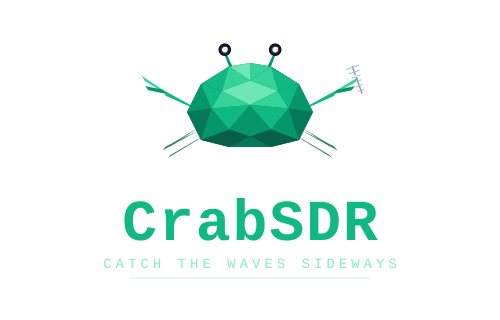
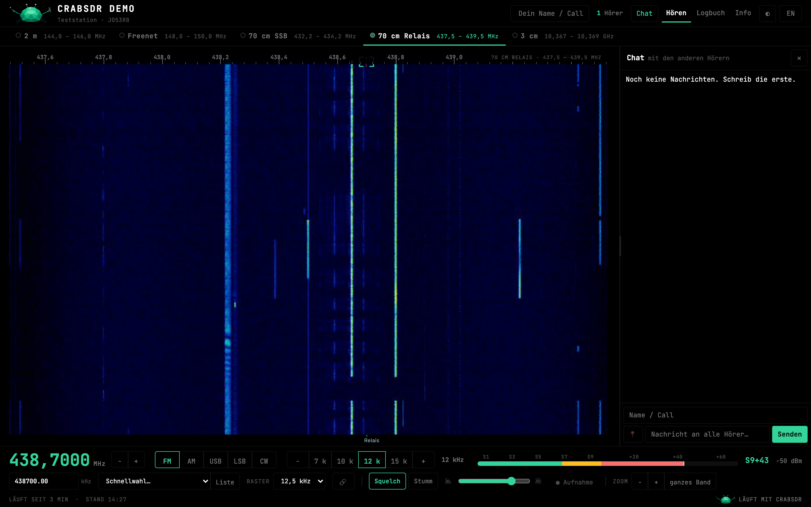
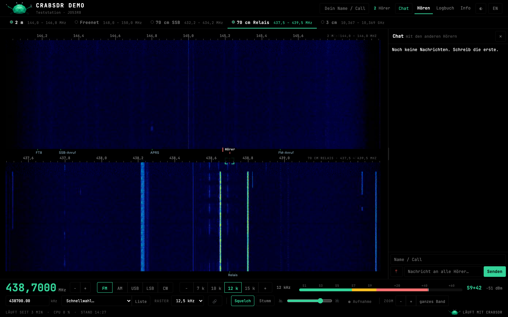
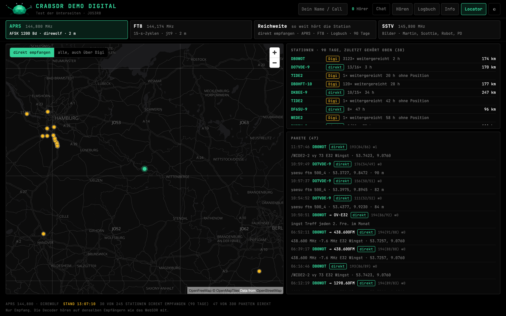
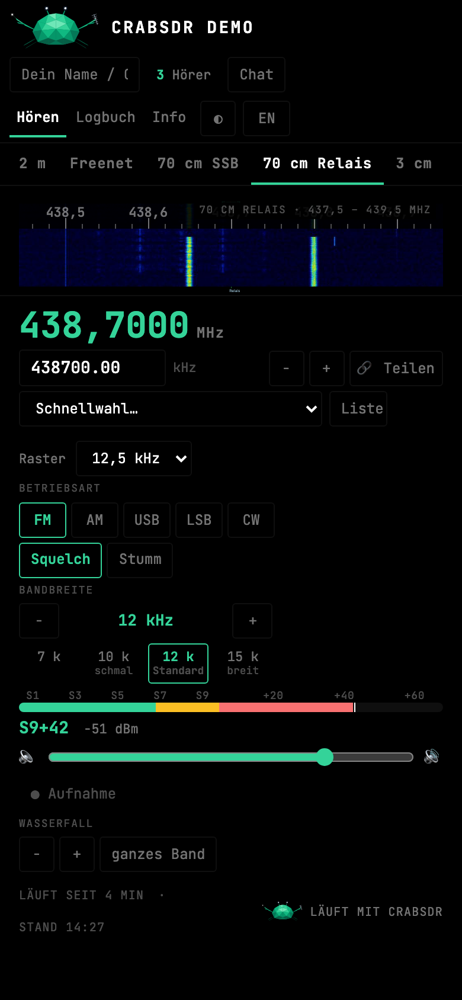

<p align="center">
  
</p>

<p align="center">
  <b>A WebSDR you can run yourself.</b> One small program turns RTL-SDR sticks into a receiver that many people
  can use in the browser at the same time – each on their own frequency.
</p>

<p align="center">
  <a href="#quick-start">Quick start</a> ·
  <a href="docs/CONFIG.md">Configuration</a> ·
  <a href="docs/ARCHITECTURE.md">Architecture</a> ·
  <a href="CHANGELOG.md">Changes</a> ·
  <a href="README.de.md">Deutsch</a>
</p>



## What it does

- **Many listeners, one receiver.** Everyone tunes independently (FM, AM, USB, LSB, CW). Listeners on the same
  frequency share one channel, so a hundred listeners cost little more than one.
- **Several bands side by side.** One stick per band; switch bands on and off, they split the screen.
- **Clean audio.** FFT channel filter with continuous phase, FM without pumping, Opus at 24 kHz (PCM fallback).
- **Decoders that never sleep.** APRS (with RX iGate to APRS-IS), FT8 and SSTV run permanently as plugins.
  Results show up on the **Digital** page: map, stations, packets, a range plot, SSTV gallery. Optional MQTT.
- **For the listeners:** chat, a logbook ("who did you hear, from where") with distance and bearing,
  share links with frequency and mode, recording to WAV, keyboard shortcuts, light and dark theme, phone layout.
- **For the operator:** a web admin page (`/admin/`) for bands, decoders, users and the config file, one small
  config file with sensible defaults, `crabsdr-server --check` before every restart, static binaries for x86-64,
  ARM64 and ARMv7 (Raspberry Pi), Docker images, systemd service.
- **Members and private bands.** Bands can be public, for signed-in members, or admin only; decoders can be
  restricted the same way. Accounts, sessions and the admin page follow [docs/SECURITY.md](docs/SECURITY.md).

| Two bands | Digital: APRS | Phone |
|---|---|---|
|  |  |  |


## Quick start

You need an RTL-SDR stick, or any source that speaks `rtl_tcp`, a HackRF, or SoapySDR via `rx_sdr`.

### Release archive (Debian, Ubuntu, Raspberry Pi OS)

```bash
tar xzf crabsdr-0.2.0.tar.gz && cd crabsdr-0.2.0
sudo ./install.sh
```

`install.sh` installs `rtl-sdr`, blocks the DVB kernel driver, creates the service user, copies everything to
`/opt/crabsdr` and a starting config to `/etc/crabsdr/config.toml`, checks it and starts the service.
Open `http://<machine>:8080`. The admin page is `/admin/`; the first password for the account `admin` is printed
once in the log (`journalctl -u crabsdr | grep Passwort`) and must be changed on first sign-in. After editing the config
by hand:

```bash
sudo /opt/crabsdr/bin/crabsdr-server --check /etc/crabsdr/config.toml && sudo systemctl restart crabsdr
```

### Docker

```bash
sh packaging/build-binaries.sh amd64      # or arm64 / armv7; needs Docker, builds static binaries into dist/bin
docker compose -f packaging/docker-compose.yml up -d --build
```

The first start writes `data/config.toml` (next to the compose file) from the template. The full image contains
the decoders (direwolf, WSJT-X, numpy); `packaging/Dockerfile.lite` builds a small image without them.

### From source

```bash
cd backend-rs && cargo build --release
./target/release/crabsdr-server ../packaging/config.example.toml
```

## Configuration

One TOML file. A station needs a name and one band; everything else has defaults.

```toml
[station]
name = "My WebSDR"
locator = "JO53RB"

[[bands]]
id = "2m"
label = "2 m"
driver = "rtl_sdr"          # rtl_sdr, rtl_tcp, hackrf, rx_sdr
device = "0"                # index or serial number
center_freq = 145000000
gain = 30

[[decoders]]                # optional
plugin = "aprs"
freq = 144800000
```

Every key is explained in [docs/CONFIG.md](docs/CONFIG.md) (German), a commented template is
[packaging/config.example.toml](packaging/config.example.toml). A broken or unreadable config never starts silently
with defaults: crabSDR stops with the line and column of the error, and `--check` reports typos, decoders outside
all bands, missing programs and unreachable sources.

A **site folder** (`site_dir`) adds your logo, quick-select presets, markers, a repeater list or your own info page
without touching the program files.

## Decoders

A decoder is a folder in `plugins/` with a `decoder.json` (what it needs: mode, sample rate, bandwidth, programs)
and a program that reads audio on stdin and prints JSON lines. crabSDR starts it, feeds it, restarts it and passes
its results on. Included:

| Plugin | Needs | Result |
|---|---|---|
| `aprs` | direwolf | packets, stations (direct or via digipeater), repeaters, optional RX iGate |
| `ft8` | jt9 (WSJT-X) | decodes, stations with locator over 90 days |
| `sstv` | python3-numpy, python3-pil | images (Martin, Scottie, Robot, PD – the ISS uses PD 120) |

## Development

```bash
python3 tools/phase0/synth.py testdata/synth.cu8 --sec 30   # test signal for the DSP golden test
(cd backend-rs && cargo test --workspace)
tools/e2e/run.sh                                            # browser tests, see tools/e2e/README.md
```

The web interface in `web/` is plain HTML, CSS and JavaScript without a build step. Code comments and most
documentation are in German.

## License

MIT – see [LICENSE](LICENSE). crabSDR contains no code from other WebSDR programs.

## Author

Dirk, DO1XX
